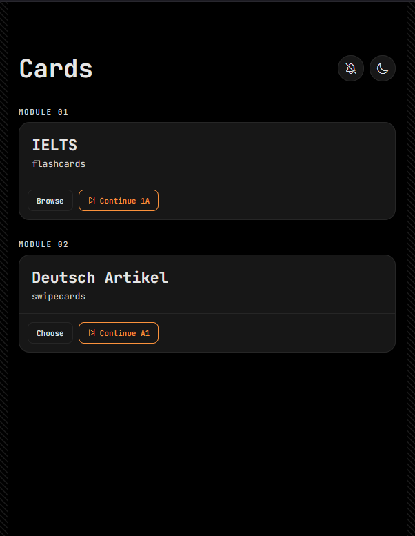

# Cards

Learn vocabulary in short, tappable bursts. IELTS words on one side, German der/die/das on the other - same app, same habit, ten minutes a day.

---

## The Idea

Vocabulary lists are easy to open once and never again. Cards keeps the loop small: pick a section, flip or swipe through a stack of words, close the app.

Two modules live side by side because they train different muscles - IELTS is recognition and recall, German articles are pattern instinct. Both use the same swipeable, thumb-friendly card format.

---

## What You'll See

| Module           | Format                                  | What it trains                     |
| ---------------- | --------------------------------------- | ---------------------------------- |
| IELTS Vocabulary | Flip cards, grouped into topic sections | Word meaning, usage, recall        |
| Deutsch Artikel  | Swipe cards (left/right)                | Instinct for _der_ / _die_ / _das_ |

**IELTS flashcards** - browse by section, flip a card to reveal the definition, step through with prev/next.

**Deutsch Artikel** - a German noun appears with its English meaning underneath; swipe to guess the article and get instant right/wrong feedback. Levels run A1 → B1, with an accuracy percentage shown once you've started a level.

---

## Progress

Your current section, word position, score, and streak are saved automatically as you go. Reopen the app and "Continue" picks up on the exact word you left off on - no need to re-find your place.

Light and dark themes are both supported, and switch instantly from the toggle in the top bar.
